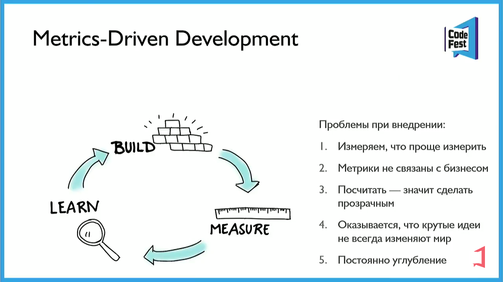
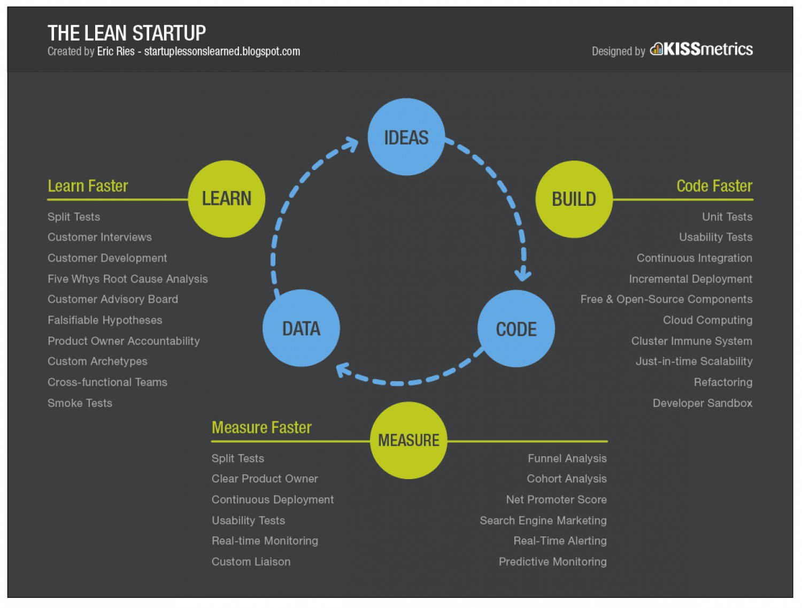

# Бизнес аналитика

- [Бизнес аналитика](#бизнес-аналитика)
  - [Порядок артефактов\\активностей](#порядок-артефактовактивностей)
  - [Карта влияния Impact Mapping](#карта-влияния-impact-mapping)
  - [Event Storming](#event-storming)
  - [Metrics Driven Development, Lean Startup](#metrics-driven-development-lean-startup)
  - [Use Case (UC) Сценарии использования](#use-case-uc-сценарии-использования)
  - [User Story (US) Пользовательские истории](#user-story-us-пользовательские-истории)
    - [UC vs US](#uc-vs-us)
  - [Бизнес процесс (БП)](#бизнес-процесс-бп)
  - [Постановка задачи](#постановка-задачи)
  - [Технический дизайн](#технический-дизайн)

## Порядок артефактов\активностей

[Понимание предметной области](http://agilemindset.ru/%d0%b2%d0%b0%d0%b6%d0%bd%d0%be%d1%81%d1%82%d1%8c-%d0%bf%d0%be%d0%bd%d0%b8%d0%bc%d0%b0%d0%bd%d0%b8%d1%8f-%d0%bf%d1%80%d0%b5%d0%b4%d0%bc%d0%b5%d1%82%d0%bd%d0%be%d0%b9-%d0%be%d0%b1%d0%bb%d0%b0%d1%81/):

- Какую проблему мы хотим решить?
- Кто пользователи/заказчики?
- Как выглядит процесс от начала и до конца в реальном мире?
- Какие риски и ограничения существуют?
- Есть ли зависимости?
- Какую ценность несет наше решение?

Подходы к аналитике:

1. Карта влияния Impact Mapping
2. Event Storming
3. UC\US
4. БП
5. DDD проектирование

Первичны бизнес процессы, которые в 1ю очередь бизнес хочет увидеть в новой ИС.
Затем уже связанные с ними инфопотоки. В BPMN нотации они есть.
DFD еще плодить по моему спорный вопрос с учетом создания реестра БП компании в BPMN нотации.

БП дают плохое представление о Движении информации.

БП - это о том:

1. кто какие Действия делает (User Task, Service Task)
2. какова логика перехода от одного действия к другому
3. какие события являются триггерами для этих действий
  
## Карта влияния Impact Mapping

[Зачем](https://scrumtrek.ru/blog/product-management/3326/impact-mapping-guide/)

- Для формирования бэклога
- Для определения рисков
- Для выявления конфликтов интересов заинтересованных лиц
- Для генерации гипотез по развитию продукта

Подход

- [зачем, кто, как, что](https://scrumtrek.ru/blog/product-management/3326/impact-mapping-guide/)
- какум проблему решаем: чтобы что?

## Event Storming

- сущности, генерируемые события, бизнес контексты

## Metrics Driven Development, Lean Startup

- Customer journey mapping клиентский путь
  - [mermaid](https://mermaid-js.github.io/mermaid/#/./user-journey)
- В основе концепции lean startup лежит цикл обратной связи __создать-оценить-научиться__. Важнейшая задача и суть управления стартапом — стремиться сокращать время цикла обратной связи.
- Бизнес метрики, посчитать как сейчас, что будет
- Мнение заказчика по гипотезам-проблемам с ценностью
- Критерии успеха бизнес инициативы Goal Question Metric model
- Продуктовые метрики качества
- Непрерывная добыча данных
- Каждая задача должна быть оценена в деньгах бизнесом: гипотеза ценности и гипотеза роста
- Разрабатывайте полноценную версию фичи после подтверждения ее эффективности через MVP

## Use Case (UC) Сценарии использования

- может описываться взаимодействие двух или большего количества участников, имеющее __конкретную цель__.
- описывает: цель, пред- и пост-условия, триггеры, основные и альтернативные потоки, а также бизнес-правила
- объединяет функциональные требования по контексту для достижения цели пользователя, т.е. один UC может содержать более одного ФТ на множество ИС.
  - [можем выявить гораздо больше функциональных требований](https://systems.education/use-case): практически каждая строчка Use Case является отдельным функциональным требованием. Мы видим, какие функции должны выполняться вместе, а следовательно, у нас есть возможность выставлять приоритеты реализации этих требований так, чтобы они были готовы в одно время.
- обычно не содержит деталей реализации и пишется на __языке целей пользователей__

## User Story (US) Пользовательские истории

- <Роль> [должен иметь возможность](https://scrumtrek.ru/blog/product-management/3364/user-story-instruktsiya-po-primeneniyu/) <возможность> в <показатель производительности> с <момент отсчета> в <условия эксплуатации>, чтобы <ценность>
  - Например, Администратор клиники должен иметь возможность просмотреть данные о прошлых и запланированных посещениях пациента в течение 3 секунд после определения личности клиента по номеру телефона входящего звонка, чтобы добавить новое или изменить запланированное посещение.
- <Система> должна <выполняемая функция> <объект> каждые <производительность> <единица измерения>, чтобы <ценность>.
  - Например, CRM-система должна отправлять СМС-напоминание клиенту о предстоящем посещении за сутки перед посещением, чтобы он помнил о приеме и пришел вовремя.
- [INVEST](https://habr.com/ru/post/577420/)
  - I — Independent — Независимый
  - N — Negotiable — Обсуждаемый
  - V — Valuable — Ценный
  - E — Estimable — Оцениваемый
  - S — Small — Компактный
  - T — Testable — Тестируемый

### UC vs US

- [сценарии использования (Use case), в отличие от пользовательских историй (User Story)](https://babok-school.ru/blogs/user-story-vs-use-case-and-uml/), описывают процесс и его шаги подробно, предоставляя всю необходимую информацию о взаимодействии актора с системой, включая цель, пред- и пост-условия, триггеры, основные и альтернативные потоки, а также бизнес-правила

## Бизнес процесс (БП)

TO-DO

- BPM
- BPMN
  - [дизайнеры](https://stormbpmn.com/compare)
    - visio
    - bizagi
    - stormbpmn
- BPMS - [автоматизация процессов BPMN](https://www.g2.com/products/camunda-platform/competitors/alternatives)
  - camunda
  - todo
  - [Activiti framework (Java) 6.0.0](https://www.activiti.org/)
    - [User guide](https://www.activiti.org/userguide/)
    - [REST API](https://habr.com/ru/post/416491/)
    - [Designer Eclipse](https://www.activiti.org/userguide/#eclipseDesignerInstallation)

## Постановка задачи

Все задачи, связанные с обработкой и хранением данных аналитик описывает на __Прикладном уровне__, а не Системном уровне (он описывается отдельно при необходимости в Техническом дизайне).

- Аналитик описывает прикладную задачу в терминах
  - Сущность, Атрибут
  - Хранилище данных (База данных).
    - Над хранилищем данных условно доступны две операции: Сохранить данные, Прочитать данные
  - Сервисная шина (Общая шина). Над Шиной доступны следующие логические операции:
    - Широковещательная, слепая рассылка извещений о событиях
      - Рассылка события / Подписка на событие
    - Асинхронный RPC
      - Вызов удалённой процедуры
- Аналитик не описывает Системный уровень (в контексте контретной СУБД MSSQL, RMQ, например)

Пример:

- Система должна предоставлять возможность внешним системам выполнять Команду "Команда" к Сущности.
- Система должна предоставлять хранить Данные по Сущности
- Система должна предоставлять возможность внешним системам делать Запрос о "Запрос".

## Технический дизайн

Пример:

- Создать в базе данных ИС таблицу Таблица1 для Назначение со следующей структурой:
(Атрибуты)
- Создать в HTTP REST API для запроса
- Создать в HTTP REST API для команд
